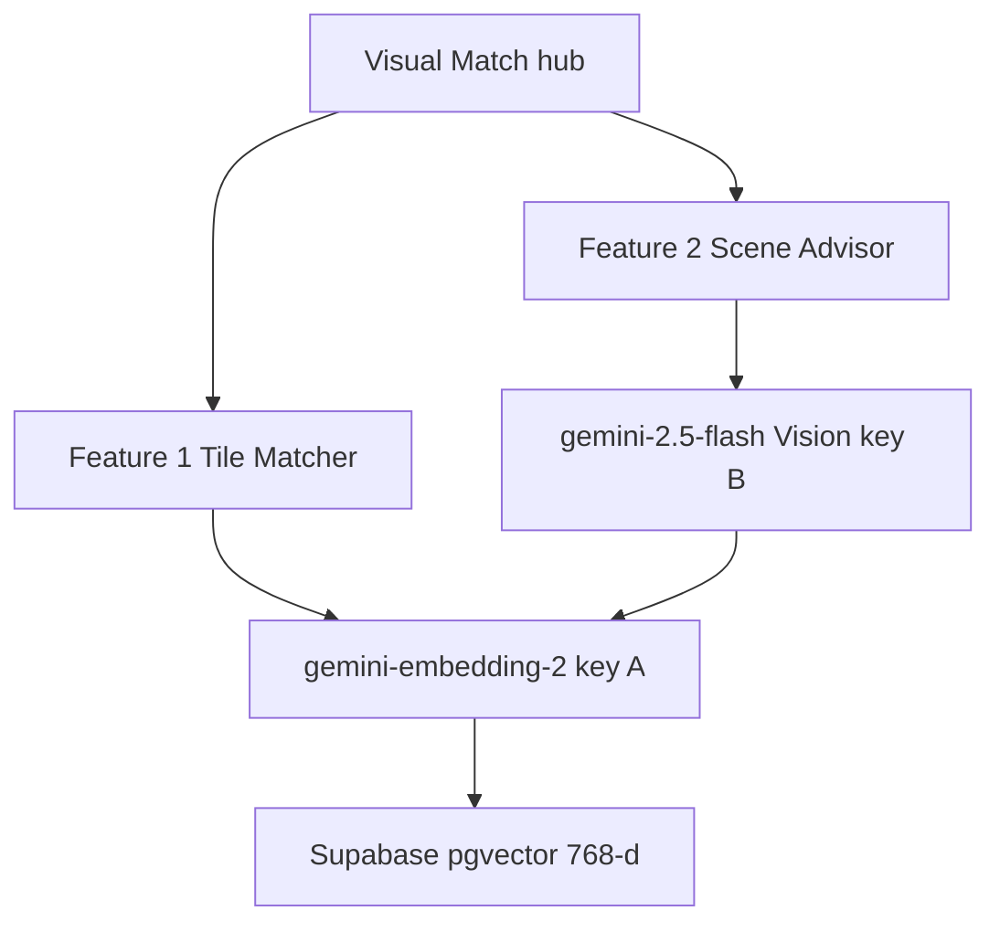

# Visual Match — locked specification

**Status:** locked 19 August 2026  
**Host:** Next.js on Vercel + Supabase (no VPS)  
**Do not reopen:** CLIP / ONNX, Hugging Face, seed-with-a-different-model, LLM-picks-SKUs

This document is the source of truth for the Visual Match feature. Implementation must follow it.

---

## What we are building

Two public features behind one hub at `/visual-search`. No login required.

1. **Tile Matcher** — the user uploads a design, tile photo, or material crop. We return similar tiles from the UN Tiles catalog.
2. **Scene Advisor** — the user uploads a photo of a room. We read the theme (light, colour, style) and recommend catalog tiles that fit that space.

Homepage CTA, plus nav and footer links next to Planner. Results reuse existing `ProductCard` (cart and stock behaviour unchanged). Disclaimer: AI is a starting point; confirm colour in the showroom.

**Out of scope for v1:** search history, login-gated saves, colour facet columns, CLIP, Hugging Face.

---

## Locked decisions

1. Two public features, one hub, no login.
2. Feature 1: image embed → pgvector k-NN. No Vision.
3. Feature 2: Flash Vision brief → embed `idealTileQuery` text → same k-NN. `generateContent` never returns product IDs.
4. Embedding model: `gemini-embedding-2`, `output_dimensionality: 768`, same for seed, image query, and text query. **v2 (19 Aug 2026):** Gemini Embedding 2 has no `taskType` param — put task prefixes in the prompt. Catalog rows are documents (`title: {name} | text: {finish/category}` + image). Matcher queries use `task: search result | query:` + image. Scene Advisor queries use `task: search result | query: {idealTileQuery}`. Stored `model` value is `gemini-embedding-2:v2` so incremental reindex rewrites v1 vectors.
5. Vision model: `gemini-2.5-flash` (structured JSON). **Confirmed available** as a stable Gemini API model (image + text in, text out, structured outputs supported) as of 19 Aug 2026. Official shutdown is **16 Oct 2026**; replacement Google lists is `gemini-3.6-flash`. Fallback order if `2.5-flash` 404s: `gemini-3.5-flash`, then `gemini-3.6-flash`. Do not use image-generation models (`*-flash-image`). For JSON-only scene briefs, set thinking budget to 0 if the SDK exposes it, to avoid extra latency on free tier.
6. Two keys from two legitimate Google AI Studio projects (e.g. two group members), not throwaway accounts:
   - `GEMINI_EMBED_API_KEY` (project A) — all embeddings, including catalog seed
   - `GEMINI_VISION_API_KEY` (project B) — scene `generateContent` only
7. Host: Vercel. No ONNX, no `@xenova/transformers`, no Hugging Face, no VPS.
8. Seed with Gemini embeddings only. Never CLIP for seeding.
9. Reindex incrementally (one product per request). Skip if `image_url` **and** `model` (`EMBEDDING_VERSION`) are unchanged.

---

## Why this split

CLIP is the right *idea* (vectors + cosine) but cannot run inside Vercel serverless (ONNX size, native binaries, cold start).

Gemini Embedding 2 maps **images and text into one vector space**, so:

- Feature 1 can match tile photo → catalog tile photos
- Feature 2 can match a short “ideal tile” sentence → the same catalog image vectors

Gemini chat is **not** the matcher. Asking a generative model “which SKUs look similar” is slow, non-deterministic, and the “API wrapper” viva critique.

**Viva line:** two Gemini *endpoints*, not one chat wrapper. Retrieval is our database. Generation only writes the interior brief.

---

## Architecture

### Feature 1 — Tile Matcher

Input: design / tile photo / texture (not a full room).

1. Convert upload to JPEG (max 1536px, q90). Centre-crop extreme aspect ratios.
2. `embedContent` with `gemini-embedding-2` (key A), 768-d, search-result query prefix + image.
3. `match_product_embeddings` RPC pulls top 16 neighbours.
4. Re-rank with HSV colour histogram (70% cosine + 30% colour). Show top 8 `ProductCard`s.

No generative call on this path.

### Feature 2 — Scene Advisor

Input: kitchen, bathroom, living room, or other space.

1. `generateContent` with `gemini-2.5-flash` (key B) → JSON:
   - `roomType`
   - `lighting`
   - `palette` (hex)
   - `styleTags`
   - `surfaces` (floor / wall / both)
   - `idealTileQuery` (one short sentence, e.g. “warm beige matte marble-look floor tile with soft grey veining”)
2. Embed `idealTileQuery` with `gemini-embedding-2` (key A), 768-d, search-result query prefix.
3. Same RPC against catalog **document** vectors (caption + image).
4. Re-rank neighbours against the scene palette histogram. UI shows palette + tags from step 1, and ProductCards from step 3.

If generate fails: do not invent SKUs. If generate works and embed fails: still show the scene brief.

---

## Two API keys

| Env var | Project | Used for |
|---------|---------|----------|
| `GEMINI_EMBED_API_KEY` | A | All `embedContent`: seed, Feature 1 upload, Feature 2 text query |
| `GEMINI_VISION_API_KEY` | B | Feature 2 `generateContent` only |
| `SUPABASE_SERVICE_ROLE_KEY` | — | Server-only RPC / upsert. Never expose to the client. |

Feature 1 never touches key B. If Vision is rate-limited, Matcher still works.

---

## Seeding

**Seed with `gemini-embedding-2` (key A). Do not seed with CLIP or any other model.**

Seed and query must use the same checkpoint. CLIP-seeded rows + Gemini query vectors produce random ranking.

- About 38 catalog images, once. Re-run `npm run reindex:visuals` after an embedding-version bump (`gemini-embedding-2:v2`).
- Re-embed when a product `image` URL changes **or** `model` is not the current `EMBEDDING_VERSION`.
- Admin reindex: **one product per request** with a 1–2s gap (Vercel timeout + free-tier RPM).
- Do not embed all 38 tiles in a single serverless invocation.

At query time we embed only the user’s image (or one sentence). Catalog math is already in Postgres.

---

## Cost and free tier

Student scale can run at **$0** on Gemini Free tier + existing Vercel + Supabase.

- Embeddings (key A): free of charge on Free tier. Seed 38 tiles once.
- Flash Vision (key B): free of charge on Free tier.
- pgvector: included on Supabase. 38 × 768-d vectors are tiny.

**Catches:**

- RPM / RPD still apply **per project** (two keys raise the combined cap; they do not make it infinite).
- Free-tier prompts and images may be used to improve Google products. Hub copy must say photos are sent to Google.
- App-side: ~10 requests/min/IP, max ~4 MB, JPEG/PNG/WebP in (WebP converted to JPEG before embed).

---

## Reliability

| Layer | Expectation |
|-------|-------------|
| Pre-seeded vectors + cosine in Postgres | High. Same vectors, same formula, same ranking. |
| Gemini embed / generate | Good, with retries. On 429/5xx show an error; do not invent tiles. |
| Feature 1 quality | Good for tile / material photos. Colour re-rank helps same-series shade splits. Weak on busy rooms (use Feature 2). |
| Feature 2 quality | Better once catalog vectors include captions. Sentence vs product photo is still looser than image-to-image; brief + palette carry the page. |

Backoff on 429. L2-normalize in app code before insert/query even though Embedding 2 auto-normalizes truncated 768-d vectors.

---

## Data layer

Migrations: `migrations/020_visual_search.sql`, `migrations/021_visual_search_color.sql`

- `create extension if not exists vector with schema extensions;`
- Table `product_embeddings`:
  - `product_id text` PK → `products.id` ON DELETE CASCADE
  - `embedding vector(768) NOT NULL`
  - `model text NOT NULL` (store `gemini-embedding-2:v2`)
  - `image_url text NOT NULL`
  - `color_histogram real[]` (optional; migration `021`. Matcher also computes HSV from catalog JPEGs if the column is absent.)
  - `updated_at timestamptz`
- At 38 rows, exact `ORDER BY embedding <=> query LIMIT n` is enough (no HNSW required).
- SECURITY DEFINER RPC `match_product_embeddings(query vector(768), match_count int)`
- **RLS:** enable RLS. **No public SELECT** on `product_embeddings` (vectors are not a public API). Writes via service role only. Matching goes through the RPC (`SECURITY DEFINER`), not through a client-readable table.

Enable the `vector` extension in the Supabase dashboard if the migration cannot. Embed-on-save from `src/app/actions/admin.ts` must not block inventory CRUD.

---

## App files (to implement)

- `src/lib/visual-search/gemini-embeddings.ts` — `embedCatalogDocument`, `embedQueryImage`, `embedQueryText`, dim 768, key A
- `src/lib/visual-search/image-input.ts` — WebP/PNG/JPEG → JPEG bytes (`sharp`); match vs scene framing
- `src/lib/visual-search/color-histogram.ts` — 32-bin HSV for re-rank
- `src/lib/visual-search/retrieve.ts` — RPC + colour blend
- `src/lib/visual-search/gemini-scene.ts` — structured Vision JSON, key B
- `src/lib/visual-search/indexProduct.ts`, `types.ts`, `cosine.ts`
- `src/app/api/visual-search/reindex/route.ts` — **admin-only, one product per request** (same pattern as `/api/seed`)
- `src/scripts/reindex-visuals.ts` — local CLI to seed all ~38 tiles with a 1–2s gap (preferred for first seed; avoids Vercel timeout). Not `seed_embeddings.js` at the repo root.

**Packages:** `@google/genai`, `sharp` (ships its own types; do not add `@types/sharp`).  
**Do not add:** `@xenova/transformers`, Hugging Face clients.

**Uploads:** JPEG/PNG/WebP, max ~4 MB. Embedding API accepts PNG/JPEG only after conversion.

**Public routes** (`match`, `scene`): IP rate limit ~10/min. Admin reindex is not public.

**Embed-on-save:** do not fire-and-forget an async index on Vercel (the isolate can freeze after the server action returns). Prefer `waitUntil` / `after()` if available, otherwise best-effort `await` with a short timeout, and always allow the admin reindex/CLI to repair misses.

---

## Implementation-plan review (19 Aug 2026)

Reviewed against this spec. **Approved to implement with the corrections below.** The pasted plan matches the architecture (two keys, 768-d, Matcher vs Advisor, hub UI). Changes required:

| Proposal | Verdict |
|----------|---------|
| `@google/genai` + `sharp` | Keep. Skip `@types/sharp`. |
| `product_embeddings` + RPC | Keep. Optional `similarity_threshold` on the RPC is fine. |
| RLS: public read on embeddings | **Reject.** Service role + SECURITY DEFINER RPC only. |
| `src/utils/supabase/admin.ts` service-role client | Keep. Server-only. |
| Vercel `reindex` **batch** of 38 | **Reject.** One product per HTTP request. Full catalog seed = local CLI. |
| `seed_embeddings.js` at repo root | Rename to `src/scripts/reindex-visuals.ts`. |
| Non-blocking `indexProduct()` in admin actions | **Unreliable on Vercel.** Use `after()` / `waitUntil` or await with timeout. |
| Match/scene `maxDuration = 30` | Keep. Add IP rate limit. |
| Hub UI + nav/footer/homepage CTA | Keep. Match existing light luxury storefront; do not invent a dark-mode system. Wrap `ProductCard` for similarity badges rather than overloading cart logic. |
| `gemini-2.5-flash` | **Keep.** Available now. Fallbacks documented above. |

---

## Implementation order

1. This file (done).
2. Migration + RPC + env vars.
3. Embed client + JPEG convert + incremental reindex (38 vectors).
4. Matcher API + hub mode 1.
5. Scene API + hub mode 2.
6. Homepage / nav / embed-on-save.
7. Vercel test: marble close-up (Matcher); kitchen/bath photo (Advisor); 429/error copy.

---

## Before coding (checklist)

1. Two Google AI Studio keys → Vercel and `.env.local` as `GEMINI_EMBED_API_KEY` and `GEMINI_VISION_API_KEY`.
2. Enable `vector` on the Supabase project.
3. `SUPABASE_SERVICE_ROLE_KEY` on the server only. Never commit it.
